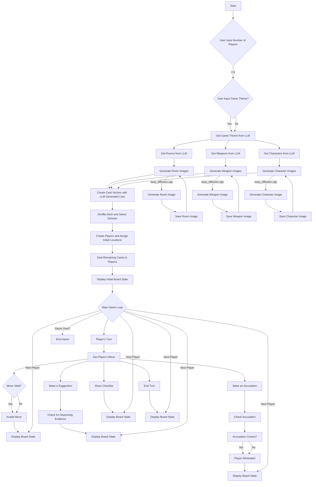

# C++ Projects: Clue Game and Easy Diffusion

This repository contains two separate C++ projects: a text-based Clue game and a program for generating images using stable diffusion.

## Clue Game

### Overview

The Clue game is a text-based implementation of the classic mystery board game. It uses an LLM (Language Learning Model) to generate random rooms, weapons, and characters. Players take turns to move around the board, make suggestions, and ultimately make an accusation to win the game.

### Prerequisites

*   C++ Compiler (C++11 or later)
*   libcurl:  A library for making HTTP requests.
    *   Installation (Debian/Ubuntu): `sudo apt-get install libcurl4-openssl-dev`
*   LLM API Endpoint: An accessible LLM API endpoint. The code is currently configured to use `http://localhost:9090/v1/chat/completions`.

### Compilation

```bash
g++ clue.cpp -lcurl -o clue
```

### Usage

1.  Run the compiled executable:

    ```bash
    ./clue
    ```

2.  Enter the number of players (2-6).

3.  Follow the prompts to play the game.

#### Notes

*   The `clue` game relies on the LLM server address.

2.  Enter the number of players (2-6).

3.  Follow the prompts to play the game.

## Easy Diffusion

### Overview

The Easy Diffusion program automates the process of generating images using a stable diffusion model running on a remote server. It is designed to work with the EasyDiffusion Stable Diffusion backend. The program constructs prompts, sends requests to the server, monitors the generation process, and saves the resulting image.

### Prerequisites

*   C++ Compiler (C++11 or later)
*   cpprestsdk: The C++ REST SDK (Casablanca).
*   Boost libraries (specifically for base64 decoding).
*   OpenSSL libraries (for base64 decoding).

### Installing Dependencies (Debian/Ubuntu)

```bash
sudo apt-get update
sudo apt-get install -y libcpprest-dev libboost-all-dev libssl-dev
```

### Compilation

```bash
g++ easy_diffusion.cpp -o easy_diffusion -lcpprest -lpthread -lz -lcrypto -lssl
```

### Usage

1.  Ensure the EasyDiffusion stable diffusion server is running at `http://localhost:9000` and the LLM server is running at `http://localhost:9090/v1`.

2.  Run the compiled executable with optional arguments:

    ```bash
    ./easy_diffusion "A detective wearing a hat, a brown hat, brown coat." "25" "512x512" "detective.png"
    ```

    *   The first argument is the prompt.
    *   The second argument is the number of inference steps (optional, default is 60).
    *   The third argument is the resolution in the format "widthxheight" (optional, default is 192x256).
    *   The fourth argument is the output filename (optional, default is output.png).

#### Notes

*   The server addresses for both the stable diffusion server (`SERVER_ADDRESS`) and the LLM server (`LLM_SERVER_ADDRESS`) are defined as constants in the `easy_diffusion.cpp` code and can be modified.
*   The `clue` game relies on the LLM server address.
*   The stable diffusion program will save the output to the directory specified in the output filename. If the directory does not exist, it will be created.


### Screenshot


### Mermaid Diagram


